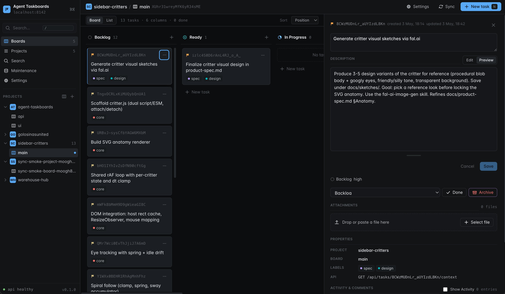

# Agent Taskboards

Agent Taskboards is a local-first Kanban task board for developers who coordinate
coding work with AI agents. It gives humans a React board UI and gives agents a
stable API for creating, moving, searching, and annotating tasks without brittle
UI automation.



The app is intentionally single-user and local. It runs in Docker, stores task
data in SQLite, and supports local semantic search over boards, tasks, and
comments with a GGUF embedding model.

## Use Cases

- Track implementation work across multiple repositories, projects, or local
  workstreams.
- Give coding agents durable task memory that survives chat sessions and
  container restarts.
- Keep project context searchable through task descriptions, comments, and board
  state.
- Coordinate handoffs by leaving append-only comments and preserving task
  activity history.
- Avoid driving a web UI from agents when a deterministic JSON API is available.

## Features

- Projects, boards, workflow columns, tasks, comments with activity history and uploads.
- Default Kanban workflow columns: `backlog`, `ready`, `in_progress`, `blocked`,
  `review`, and `done`.
- React UI for human task management.
- Express API for scripts and AI agents.
- SQLite persistence in `data/taskboards.sqlite`.
- Local semantic search over boards, tasks, and comments using `node-llama-cpp`
  and `sqlite-vec`.
- Agent helper skill and wrapper script under `skills/tasks-management/`.

## Quick Start

Start the app in Docker:

```sh
docker compose up --build
```

Then open:

```text
http://localhost:8142
```

By default, Docker Compose sets `TASKBOARDS_DEBUG=1`. In debug mode, the Vite UI
runs on port `8142`, the Express API runs on port `3000`, and Vite proxies
`/api` requests to the API server.

Run release mode by unsetting `TASKBOARDS_DEBUG`:

```sh
TASKBOARDS_DEBUG= docker compose up --build
```

In release mode, the container builds the API and UI into `dist/` and serves the
compiled Express app and static UI from port `8142`.

## Runtime Data

Docker Compose bind-mounts local runtime directories from the repository root:

- `data/` -> `/data`: durable application data. The default SQLite database is
  `/data/taskboards.sqlite`.
- `uploads/` -> `/uploads`: durable uploaded or imported files.
- `tmp/` -> `/tmp/taskboards`: scratch space for temporary generated files.

These directories are ignored by git except for their `.keep` placeholders.

## Development Commands

Project scripts are intended to run inside Docker. Do not run `npm install` on
the host machine.

Run checks in the running container:

```sh
docker compose exec taskboards npm run typecheck
docker compose exec taskboards npm run lint
docker compose exec taskboards npm run test
```

Build the app:

```sh
docker compose exec taskboards npm run build
```

Rebuild local embedding search data:

```sh
docker compose exec taskboards npm run embeddings:reindex
```

Run the embedding smoke test:

```sh
docker compose exec taskboards npm run test:embeddings
```

The local embedding model is expected at:

```text
models-gguf/bge-small-en-v1.5-f32.gguf
```

The model directory is ignored by git so model weights stay local.

## Typical Workflows

Create a project for a repository or workstream, then create one or more boards
for active implementation, backlog planning, release work, or bug triage.

Use the board UI to create tasks, edit descriptions, assign labels and
priorities, move work through columns, inspect task context, and search prior
work. Active boards hide archived content by default so the working view stays
focused.

Use comments as durable memory. Humans and agents can leave progress notes,
blockers, decisions, and handoff context on a task. Activity entries preserve
important state changes such as task creation, updates, movement, completion,
archival, and new comments.

Agents can use the API or the wrapper script in
`skills/tasks-management/scripts/taskboards` to orient themselves before doing
work:

```sh
skills/tasks-management/scripts/taskboards health
skills/tasks-management/scripts/taskboards get projects repositoryPath="$PWD"
skills/tasks-management/scripts/taskboards get projects/<projectId>/boards
skills/tasks-management/scripts/taskboards context <taskId>
skills/tasks-management/scripts/taskboards move <taskId> in_progress
skills/tasks-management/scripts/taskboards comment <taskId> "Implementation started."
```

Search before creating new tasks so agents can update existing work instead of
duplicating it:

```sh
skills/tasks-management/scripts/taskboards get search q="sqlite migration blocker" limit=10
```

## API Orientation

The JSON API is mounted under `/api`.

Useful starting points:

- `GET /api/health`: check API and database status.
- `GET /api/projects`: list active projects.
- `POST /api/projects`: create a project.
- `GET /api/projects/:projectId/boards`: list boards for a project.
- `POST /api/projects/:projectId/boards`: create a board.
- `GET /api/projects/:projectId/boards/:boardId?includeTasks=true`: read a
  board with tasks.
- `POST /api/projects/:projectId/boards/:boardId/tasks`: create a task.
- `POST /api/tasks/:taskId/move`: move a task to another column.
- `POST /api/tasks/:taskId/comments`: append a task comment.
- `GET /api/tasks/:taskId/context`: fetch task, comments, activity, and parent
  board context.
- `POST /api/search`: run local semantic search over indexed board, task, and
  comment content.

See [docs/api.md](docs/api.md) for the full API contract.

## Documentation

- [docs/taskboards.md](docs/taskboards.md): product goals and workflows.
- [docs/tasks-and-boards.md](docs/tasks-and-boards.md): domain model.
- [docs/api.md](docs/api.md): JSON API structure.
- [docs/agent-api.md](docs/agent-api.md): markdown-first agent API design.
- [docs/ui.md](docs/ui.md): UI architecture and principles.
- [docs/text-embedding.md](docs/text-embedding.md): local embeddings and vector
  search.
- [docs/maintenance.md](docs/maintenance.md): archival, cleanup, and reindexing.

## Tech Stack

- React 19 and Vite for the UI.
- Express 4 for the API server.
- TypeScript across API and UI code.
- Drizzle ORM and SQLite for storage.
- `node-llama-cpp` and `sqlite-vec` for local semantic search.
- Docker Compose for normal local operation.
